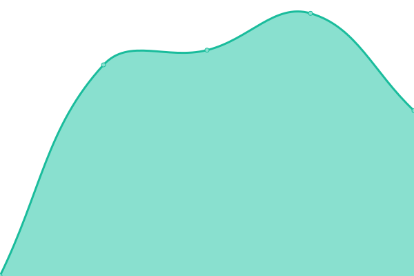
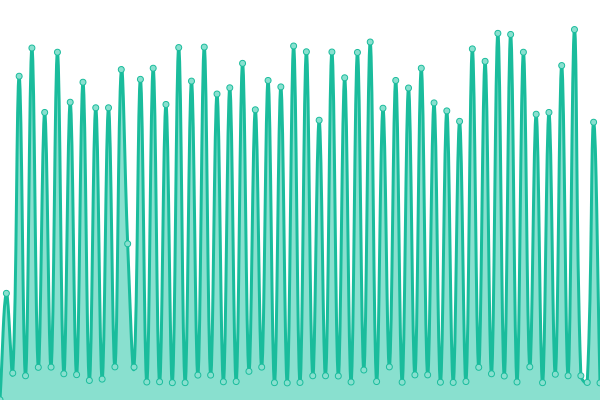

# [📈 Live Status](https://advancedcsg-open.github.io/platform-status): <!--live status--> **🟩 All systems operational**

This repository contains the open-source uptime monitor and status page for [Advanced (open source)](https://oneadvanced.com), powered by [Upptime](https://github.com/upptime/upptime).

With [Upptime](https://upptime.js.org), you can get your own unlimited and free uptime monitor and status page, powered entirely by a GitHub repository. We use [Issues](https://github.com/advancedcsg-open/platform-status/issues) as incident reports, [Actions](https://github.com/advancedcsg-open/platform-status/actions) as uptime monitors, and [Pages](https://advancedcsg-open.github.io/platform-status) for the status page.

<!--start: status pages-->
<!-- This summary is generated by Upptime (https://github.com/upptime/upptime) -->
<!-- Do not edit this manually, your changes will be overwritten -->
<!-- prettier-ignore -->
| URL | Status | History | Response Time | Uptime |
| --- | ------ | ------- | ------------- | ------ |
|  [Advanced](https://oneadvanced.com) | 🟩 Up | [advanced.yml](https://github.com/advancedcsg-open/platform-status/commits/HEAD/history/advanced.yml) | 

 940ms
     
 | 

<a href="https://advancedcsg-open.github.io/platform-status/history/advanced">100.00%</a>
    

|  Identity Services (Production) | 🟩 Up | [identity-services-production.yml](https://github.com/advancedcsg-open/platform-status/commits/HEAD/history/identity-services-production.yml) | 

 385ms
     
 | 

<a href="https://advancedcsg-open.github.io/platform-status/history/identity-services-production">100.00%</a>
    

|  Identity Services Canary (Production) | 🟩 Up | [identity-services-canary-production.yml](https://github.com/advancedcsg-open/platform-status/commits/HEAD/history/identity-services-canary-production.yml) | 

 782ms
     
 | 

<a href="https://advancedcsg-open.github.io/platform-status/history/identity-services-canary-production">54.51%</a>
    

|  Innovation POC | 🟩 Up | [innovation-poc.yml](https://github.com/advancedcsg-open/platform-status/commits/HEAD/history/innovation-poc.yml) | 

 1141ms
     
 | 

<a href="https://advancedcsg-open.github.io/platform-status/history/innovation-poc">100.00%</a>
    

<!--end: status pages-->

[**Visit our status website →**](https://advancedcsg-open.github.io/platform-status)

## 📄 License

- Powered by: [Upptime](https://github.com/upptime/upptime)
- Code: [MIT](./LICENSE) © [Advanced (open source)](https://oneadvanced.com)
- Data in the `./history` directory: [Open Database License](https://opendatacommons.org/licenses/odbl/1-0/)
