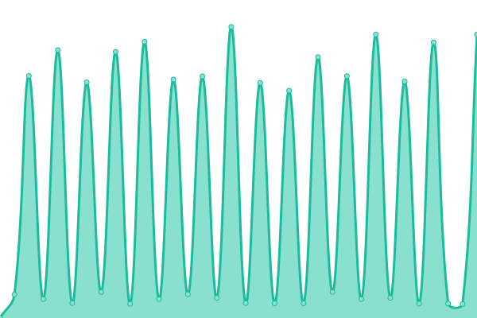

# [📈 Live Status](https://advancedcsg-open.github.io/platform-status): <!--live status--> **🟧 Partial outage**

This repository contains the open-source uptime monitor and status page for [Advanced (open source)](https://oneadvanced.com), powered by [Upptime](https://github.com/upptime/upptime).

With [Upptime](https://upptime.js.org), you can get your own unlimited and free uptime monitor and status page, powered entirely by a GitHub repository. We use [Issues](https://github.com/advancedcsg-open/platform-status/issues) as incident reports, [Actions](https://github.com/advancedcsg-open/platform-status/actions) as uptime monitors, and [Pages](https://advancedcsg-open.github.io/platform-status) for the status page.

<!--start: status pages-->
<!-- This summary is generated by Upptime (https://github.com/upptime/upptime) -->
<!-- Do not edit this manually, your changes will be overwritten -->
<!-- prettier-ignore -->
| URL | Status | History | Response Time | Uptime |
| --- | ------ | ------- | ------------- | ------ |
|  Advanced SSO (Production) | 🟩 Up | [advanced-sso-production.yml](https://github.com/advancedcsg-open/platform-status/commits/HEAD/history/advanced-sso-production.yml) | 

 495ms
     
 | 

<a href="https://advancedcsg-open.github.io/platform-status/history/advanced-sso-production">100.00%</a>
    

|  Advanced SSO (Module-Dev) | 🟩 Up | [advanced-sso-module-dev.yml](https://github.com/advancedcsg-open/platform-status/commits/HEAD/history/advanced-sso-module-dev.yml) | 

 478ms
     
 | 

<a href="https://advancedcsg-open.github.io/platform-status/history/advanced-sso-module-dev">100.00%</a>
    

|  MyWorkplace Login | 🟥 Down | [my-workplace-login.yml](https://github.com/advancedcsg-open/platform-status/commits/HEAD/history/my-workplace-login.yml) | 

 766ms
     
 | 

<a href="https://advancedcsg-open.github.io/platform-status/history/my-workplace-login">52.59%</a>
    

<!--end: status pages-->

[**Visit our status website →**](https://advancedcsg-open.github.io/platform-status)

## 📄 License

- Powered by: [Upptime](https://github.com/upptime/upptime)
- Code: [MIT](./LICENSE) © [Advanced (open source)](https://oneadvanced.com)
- Data in the `./history` directory: [Open Database License](https://opendatacommons.org/licenses/odbl/1-0/)
